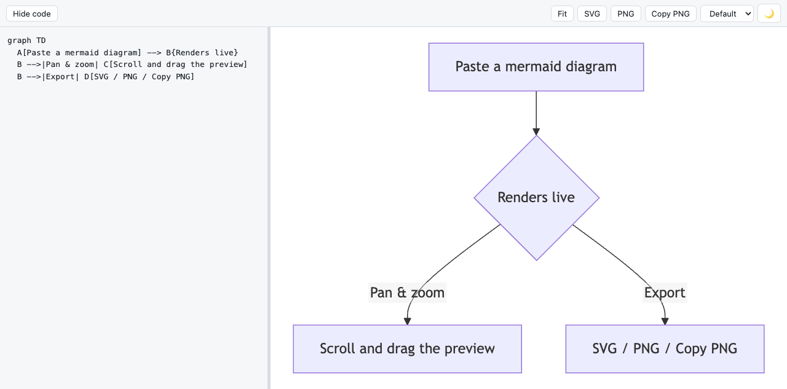
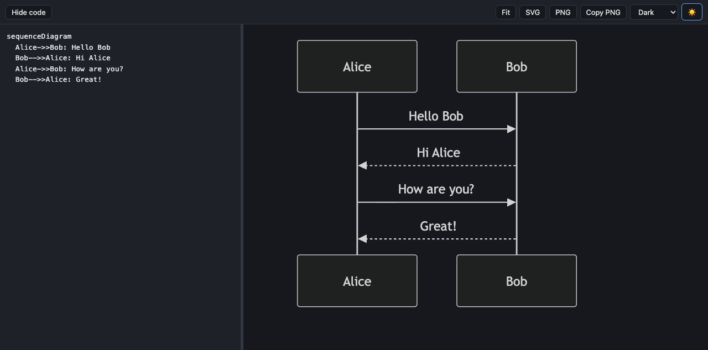

# mermview

A fully offline [Mermaid](https://mermaid.js.org/) diagram viewer that ships as **one self-contained HTML file**. Paste a diagram, see it rendered instantly — no internet, no install, no account, no build step for the user. Just open the file in any browser.



## Why

Mermaid diagrams are everywhere — READMEs, design docs, LLM output, PR descriptions — but actually *looking* at one usually means pasting it into an online editor. That's a problem when you're offline, on a locked-down network, or just don't want to ship your architecture diagrams to a third-party website.

mermview is the antidote: a single `index.html` with the entire Mermaid renderer bundled inside. Copy it to a USB stick, an air-gapped machine, a `~/tools` folder, or email it to a coworker. Double-click and it works, forever, with zero network requests.

## Features

- **Paste-first workflow** — paste anywhere on the page (you don't even need to click into the editor first) and the diagram replaces whatever was there
- **Live rendering** — re-renders ~300 ms after you stop typing; there is no render button
- **Never loses your place** — invalid syntax mid-edit keeps the last good diagram on screen, with the parse error (and line number) shown in a non-blocking bar
- **Pan, zoom, fit** — drag to pan, scroll/pinch to zoom around the cursor, one-click fit-to-view for large diagrams
- **Export** — download as SVG, download as PNG (2× resolution), or copy a PNG straight to the clipboard for pasting into Slack or docs
- **Theming** — light/dark app UI toggle, plus all five built-in Mermaid diagram themes (`default`, `dark`, `forest`, `neutral`, `base`) — chosen independently, so you can use a dark UI with light diagrams for clean exports
- **Persistent scratchpad** — your diagram, themes, and layout are saved to `localStorage`; reopening the file restores exactly where you left off
- **Resizable, collapsible editor** — drag the divider, or hide the code pane entirely and give the diagram the full window
- **Every Mermaid diagram type** — flowcharts, sequence, class, state, ER, gantt, pie, mindmaps, and everything else Mermaid supports



## Getting started

### Just use it

Grab [`dist/index.html`](dist/index.html) from this repo (Download raw file) and open it in a browser. That single file is the entire app.

### Build from source

```bash
git clone https://github.com/mraza007/mermview.git
cd mermview
npm install
npm run build     # produces dist/index.html
npm run dev       # or run a dev server with hot reload
```

## Usage notes

| Action | How |
| --- | --- |
| Load a diagram | Paste anywhere on the page, or type in the editor |
| Pan | Click and drag the preview |
| Zoom | Scroll / pinch on the preview (zooms around the cursor) |
| Reset view | **Fit** button |
| Full-window diagram | **Hide code** button |
| Resize panes | Drag the divider between editor and preview |
| Export | **SVG**, **PNG**, or **Copy PNG** buttons |
| Diagram theme | Dropdown in the toolbar |
| App light/dark | 🌙 / ☀️ button |

## How it works

- **Stack**: vanilla TypeScript, no UI framework — the whole app is ~350 lines in [`src/main.ts`](src/main.ts)
- **Single-file output**: [Vite](https://vitejs.dev/) + [`vite-plugin-singlefile`](https://github.com/richardtallent/vite-plugin-singlefile) inline Mermaid and all CSS/JS into one HTML file (~3.4 MB, ~950 KB gzipped)
- **Rendering**: `mermaid.render()` with `securityLevel: "strict"`. Flowchart labels render as SVG text rather than HTML `<foreignObject>` (`htmlLabels: false`) so that PNG export works reliably — SVGs containing `foreignObject` can't be safely rasterized to a canvas in all browsers
- **PNG export**: the rendered SVG is serialized, loaded into an `Image` via a Blob URL, and drawn onto a 2× canvas with a theme-matched background
- **State**: a single JSON blob in `localStorage` (source text, both themes, editor width, collapsed state)

Updating Mermaid means bumping the dependency and rebuilding — the pinned version is baked into the file, which is exactly what makes it dependable offline.

## Privacy

There is nothing to configure because there is nothing being sent. No network requests, no analytics, no fonts fetched from a CDN. Your diagrams never leave the browser.

## License

[MIT](LICENSE)
